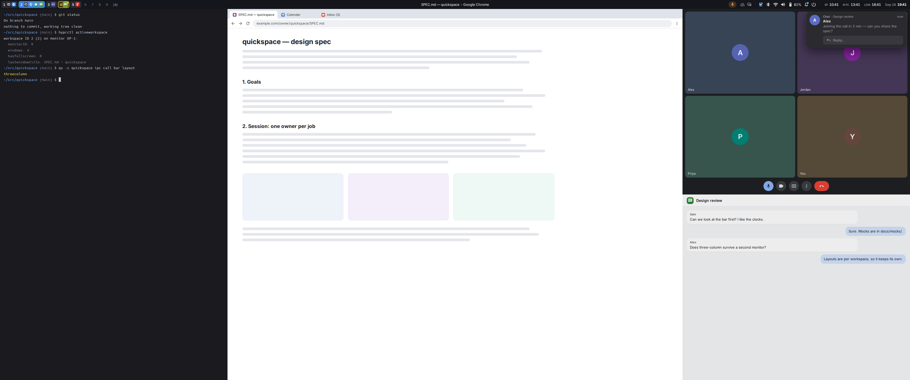

# quickspace

A small Wayland desktop built for dwm/Krohnkite-style tiling:

- **Hyprland** tiles the windows.
- **Quickshell** draws the bar, launcher, notifications, lock and login
  screens, OSDs and screen-share picker.
- **greetd** logs you in.
- **uwsm** runs the session, with one owner per job, so nothing starts twice.

**Status: milestone 2, session skeleton.** Start with the [spec](SPEC.md).
The mocks are in [`docs/mocks/`](docs/mocks/).

## Installing

`setup --quickspace` in the scripts repo will do all of this; until it lands,
this is the way to install by hand:

    make install                       # layout, user units, portal config under ~/.config
    sudo make install-session          # session entry, compositor wrapper, `quickspace` under /usr/local
    systemctl --user daemon-reload
    systemctl --user enable quickspace.service

Then pick **quickspace** at the display manager. It runs Hyprland through
uwsm as `quickspace-hyprland`, which gives the session its own systemd
target, so quickspace's units never start in a plain Hyprland or Plasma
login (SPEC.md §5.3). If the display manager doesn't list the session,
install it with `sudo make install-session PREFIX=/usr`.

Key bindings and the launcher start apps with `quickspace launch [--app ID]
COMMAND...`: it waits (at most 15 s) for the shell, gives the app a one-shot
focus grant, and runs it with `uwsm app` so it outlives a shell restart.

The shell itself isn't written yet, so `quickspace.service` doesn't start
until it is.

## Mocks

The mocks are plain HTML/CSS. To re-render the PNGs after editing one:

    make mocks

This needs Node and Playwright with Chromium.
